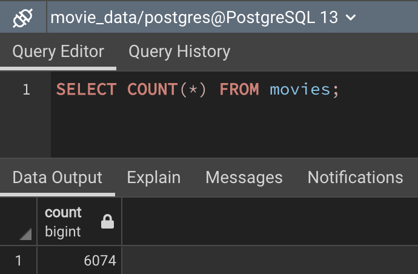
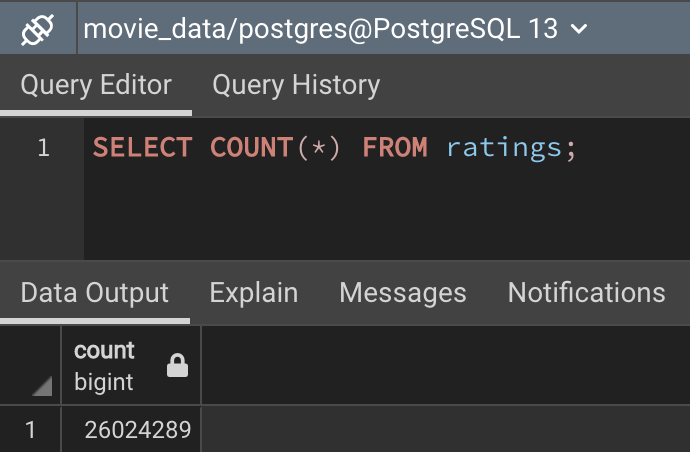

# Movies data ETL
Large data Extract, Transform, and Load (ETL) using pandas, regex, and export to SQL database

## Overview
The framework for this project was that a large movie streaming platform was preparing for a hackathon. In preparation several large datasets needed to be cleaned and prepared for use by the developers. The data used came from three sources:
- movie data from Wikipedia, in a [JSON file](data/wikipedia_movies.json) (6.2 MB);
- movie metadata downloaded from Kaggle, as a [CSV file](data/movies_metadata.csv) (34 MB);
- movie ratings data from MovieLens, as a [CSV file](data/ratings.csv) (709.6 MB).

The focus of this project was to build a program that would take in large sources of data, clean them, merge them, and then export them to a SQL server, ready for use. This was achieved by:
- importing data from large CSV files into pandas dataframes;
- removing columns or rows with unnecessary or corrupted data;
- renaming columns for easier use;
- extracting and cleaning useful data from existing columns using regular expressions;
- merging datasets to maximize utility;
- exporting data to a postgresql database.

## Results

After processing and merging the Wikipedia and Kaggle files we were left with 6,074 clean rows of usable data. The expected outcome was originally 6,052, but I was able to squeeze out an additional 22 entries by tweaking regex filters.

The large CSV of ratings data, after being exported to a PostgreSQL database, provided us with 26,024,289. This is exactly how many entries were expected. The export of the data to the database took 5,973.17 seconds, or 99.55 minutes.

## Summary
Overall this was a very interesting exercise. Regular expressions are a very powerful tool, if somewhat scary at first glance. And the ability to manipulate large datasets programmatically will doubtlessly prove to be a very useful skill going forward. I would have been interested in playing with the additional included CSVs (keywords, links, credits) to see how they fit into the larger picture. Maybe I can import those into databases and create some relationships. All in all, this is a very interesting dataset... likely one I'll return to at a later date.